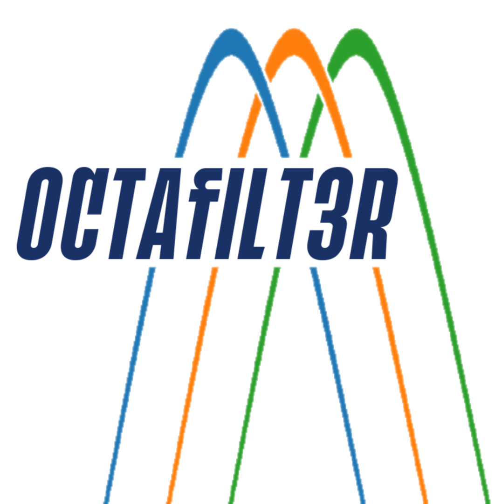

# octafilt3r

|||
|-|-|
|`octafilt3r` is a python module for continuous signal filtering with fractional octave filters. It is able to generate non-FFT-based spectrograms, which can be used for machine learning. Despite their low resolution, the spectrograms capture the most important characteristics of a sound. This makes them suitable for applications with low data troughput ||

---

## Use-cases:

* Transform an audio signal into its frequency bands without an FFT
* Generate spectrograms
* Apply A-weighting (audio only)

### Based on:

* [scipy](https://scipy.org/)
* [numpy](https://numpy.org/)
* [matplotlib](https://matplotlib.org/)

